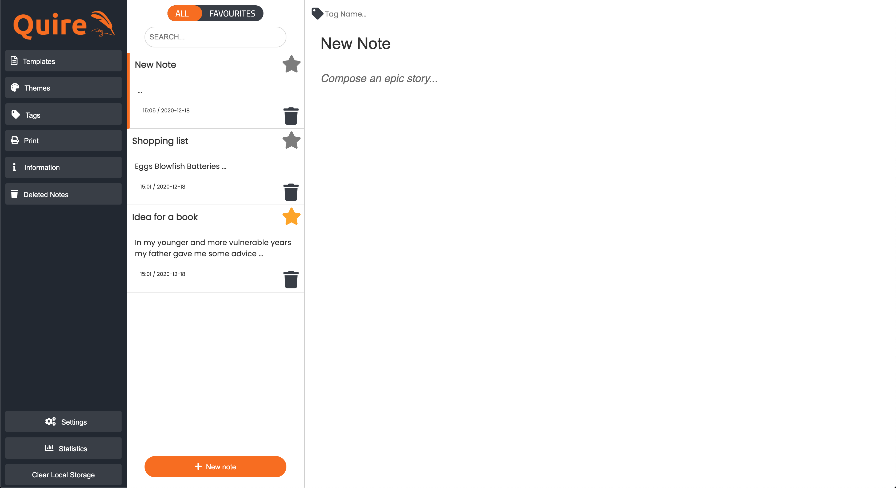

# *by Gutenberg*

A rich text editor where you can create, customize and save notes.

## INFO

### Created by

- Karl Gunnarsson (<https://github.com/KG416>)
- Jon Sundelöf (<https://github.com/jon-sundelof>)
- Jesper Pettersson (<https://github.com/JesperKYH>)
- Anton L-A (<https://github.com/xamnotna>)
- Onur Gürsoy (<https://github.com/OGurso>)

### Motivation

This is a school assignment we did when studying at kyh in Stockholm.

### Features

- Create, save and customize your notes
- Save them in local storage
- Use **templates** with pre-written text and pre-assigned formats
- Change the **theme** of your text after you've written it
- Print your notes

### Screenshots

### Trello

<https://trello.com/b/eeqZfxxm/tp1-gutenberg>

### Credits

When making this text editor, we took inspiration from:

- [Evernote](https://evernote.com/)
- [Medium](https://medium.com/)
- [Notion](https://notion.so/)
